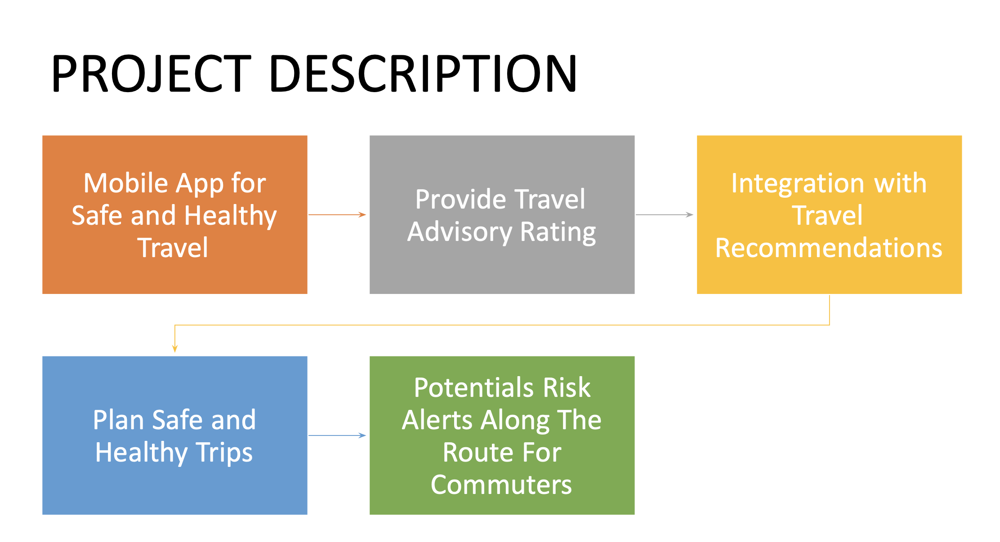
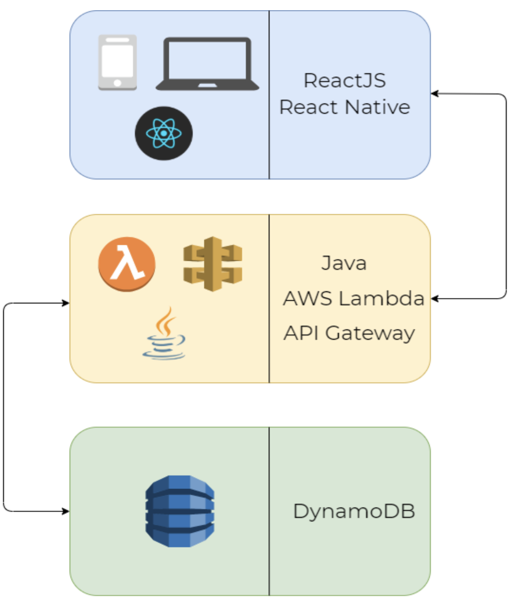
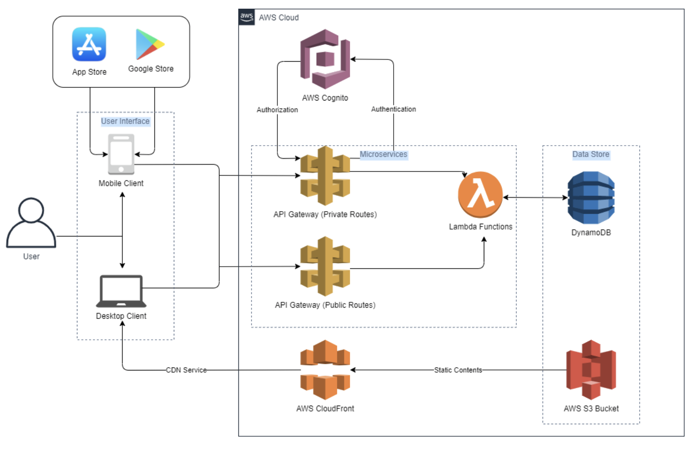
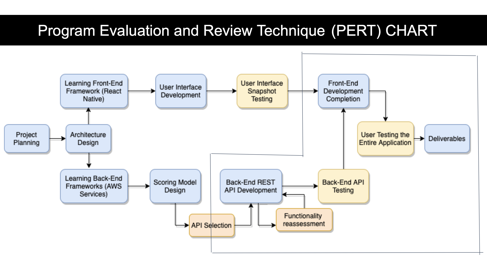

# TravSafe-Final Project Repo

## Problem Statement

- TravSafe mobile application is designed to provide travelers around the world with safe and healthy travel by providing them with real-time travel advisory ratings. In addition to travelers, travsafe also provides commuters with the option to save their commute route and provide them with hazards and real-time alerts along with the route.
- This helps the user to change their route and make better decisions. Travelers will be able to make wise and safe travel decisions using this app for all different locations they want to travel to. TravSafe provides users with to book flights, hotels, obtain a local guide along with getting safety ratings.

## What is TravSafe?

## What does it do?

## Architecture

### HLA

### Low Level Architecture

## PERT Chart

## The Current App - Working Demo

# Upcoming Fetures

1. Real-Time Score Change Alerts
2. Support For Additional Efficiency in News Scapping/ NLP support
3. Scaling the current Microservice architecture
4. Supporting Flight/Hotel Bookings, Local Transport and Maps Integrations
5. Extended User Profile Management
   ....

# Meet The Team

- Saneel Daniel - Full Stack Developer - [Linkedin](https://www.linkedin.com/in/saneel-daniel/)

- Shubham Patel - Full Stack Developer - [Linkedin](https://www.linkedin.com/in/shubham-patel28/)

- Rohan Samavedam - Full Stack Developer - [Linkedin](https://www.linkedin.com/in/rohan-samavedam-6a3612156/)
